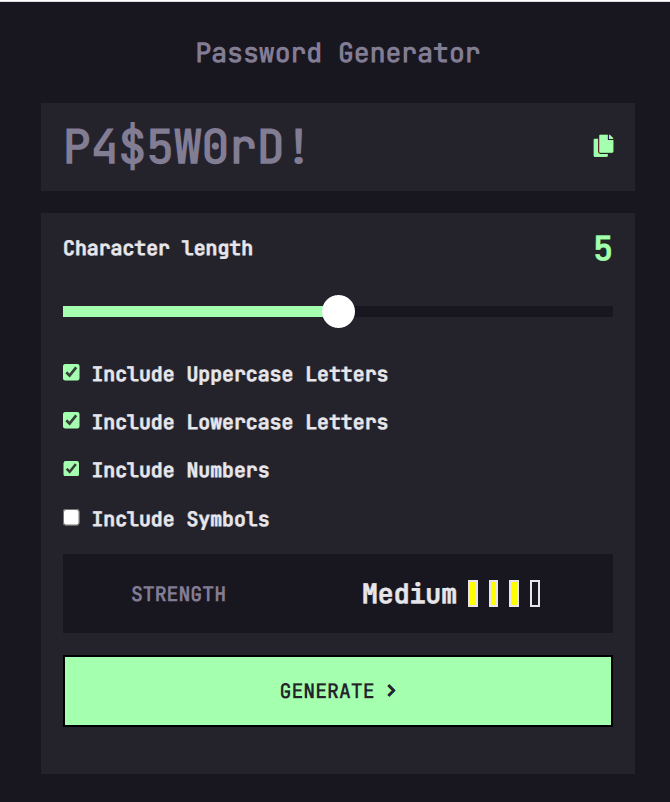
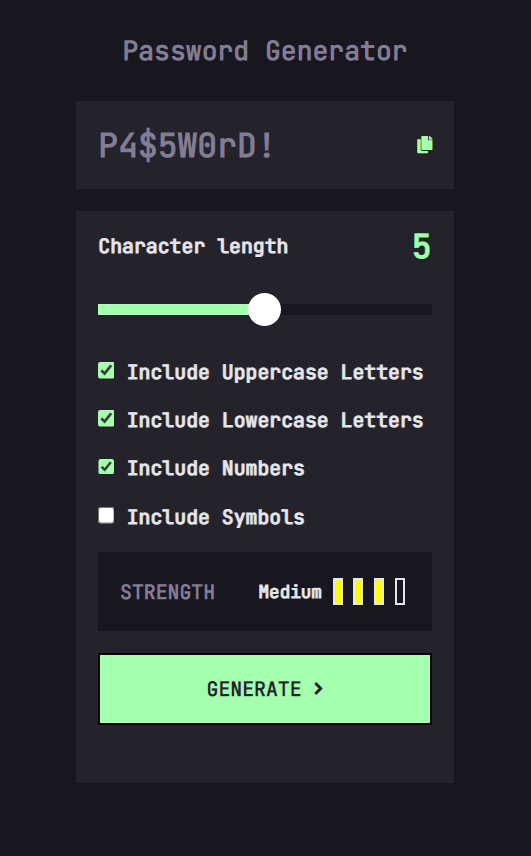

# Password Generator [September 23rd 2022]

This project is one the intermediate Javascrpit challenges from [Frontend Mentor](https://www.frontendmentor.io/).

## Table of contents

- [Overview](#overview)
  - [Screenshot](#screenshot)
  - [Links](#links)
  - [Features](#features)
- [My process](#my-process)
  - [Built with](#built-with)
  - [What I learned](#what-i-learned)
  - [Continued development](#continued-development)
  - [Useful resources](#useful-resources)
- [Author](#author)
- [Acknowledgments](#acknowledgments)

## Overview

In this project, I was able to practice everything that I've learned about Javascript and create a fun and engaging app. The password generator allows the user to enter a specific length and multiple conditions for a password. The app will also tell the user if the password is too short and if no conditions are checked. A user will not be able to generate a password if conditions are not met. Once a password is generated, the user will be able to copy the password to their clipboard.

### Screenshots

### Links

- Live Site URL: [Password Generator](https://creative-malasada-edb466.netlify.app/)

### Features

- Display password based length and conditions
- Display stength bars based on user input
- Disables generate button if conditions arent met
- Copy the password after generation

## My process

I started by looking at figma files and writing down the possible routes I can take in terms of setting up my files. I then strctured my HTML file, then i used the figma file to get the appropriate colors and sizing to set up my CSS file. Some of the logic that went into the Javascript file was apart of the challenge but most of it was me adding my own logic in an effort to make it trully my creation.

### Built with

- HTML
- CSS
- Javascript

### What I learned

This project was really tough for me to crack but with persistence and review, I have succeeded. It was also an amazing lesson and review, which further strengthened my Javascript knowledge and taught me how to deal with advanced logic.

### Continued development

The code will need additional refactoring to make it cleaner and more DRY.

### Useful resources

- [Frontend Mentor](https://www.frontendmentor.io/).

## Author

- Jaron Denzel Young

## Acknowledgments

Thank you, Frontend Mentor, for being an awesome place to learn.
